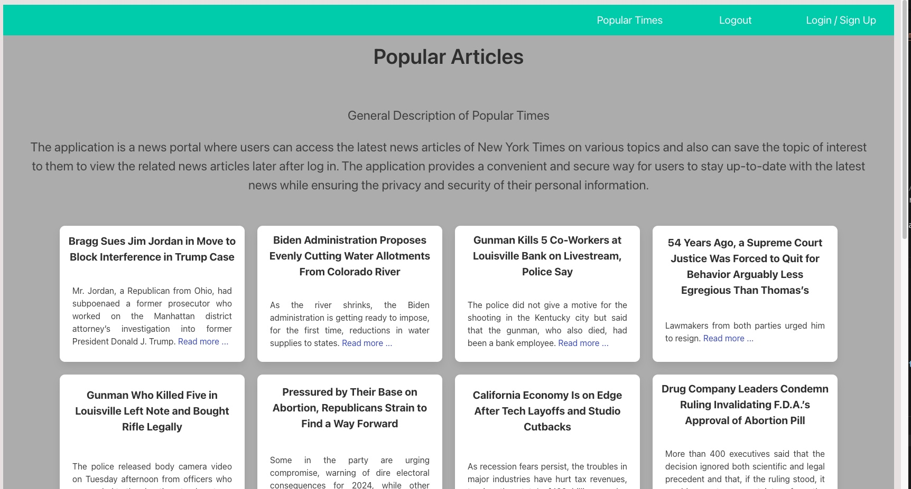

# Project 2 - Popular Times

## Description
The application is a news portal where users can access the latest news articles of New York Times on various topics and also can save the topic of interest to them to view the related news articles later after log in. The application provides a convenient and secure way for users to stay up-to-date with the latest news while ensuring the privacy and security of their personal information.

## Screenshot

## Table of Contents 

  - [User Story](#use-story)
  - [Acceptance Criteria](#acceptance-criteria)
  - [API used](#api-used)
  - [Languages Used](#languages-used)
  - [Deployed Link](#deployed-link)
  - [Installation](#installation)
  - [Credits](#credits-@-2023)
  - [License](#license)

## User Story
As a user, I want to access news articles of New York Times on the application and to save the favorite articles I need to log in/ sign up to the application. If I am not registered, I need to sign up first. Once I log in, I can logout and/or save my favorite articles.

## Acceptance Criteria
GIVEN main page displays a navigation bar with three options for login, sign up, home and logout and updated news of the day.
WHEN the user clicks on the login option
THEN the application should direct them to the login page
WHEN the user enter their username and password to log in
THEN they should be directed to home page where they can view the news articles and save the articles
WHEN the user is not registered
THEN they should sign up first
WHEN user clicks on the log out option in the navigation bar
THEN user should be directed to the main page where they need to login

## API used
* New York Times

## Languages Used
* Front-end Languages : HTML, CSS with Bulma, Javascript
* Back-end Languages : MVC, Node, Handlebars
* Database Languages : SQL, Sequelize

## Deployed Link
to be added

## Installation
This generator needs to be run in either CLI or shell.
* npm install
* npm run seed / node seeds/seed.js
* npm start / node server.js
  
## Credits @ 2023
* Erich Ziegler, Back-end
* Cody Lawson, Back-end
* Paul Duncan, Front-end
* Najiba Haidari, Front-end
  
## License
This project is under the 
